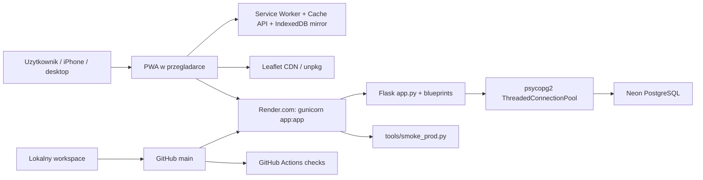
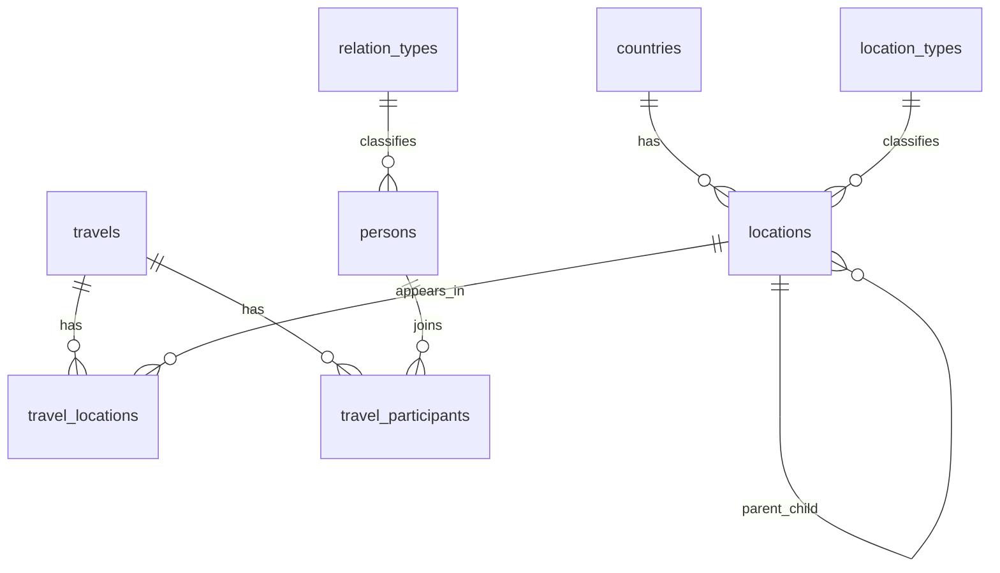
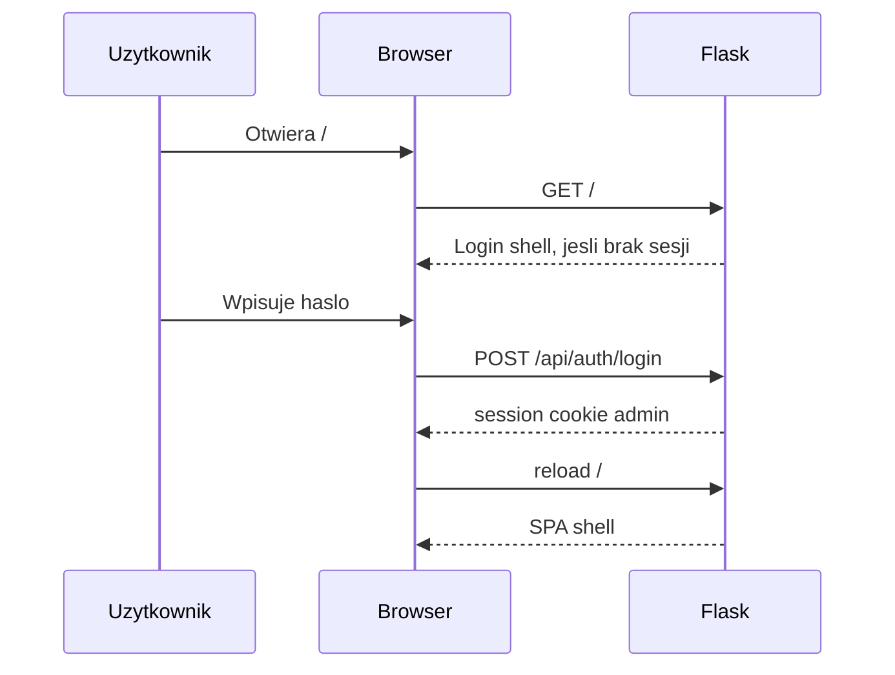

# Moje Podroze - Architecture Blueprint

Ten dokument jest mapa aktualnej aplikacji `Moje Podroze`: co gdzie mieszka,
jak plyna dane, gdzie sa testy/smoke'i, jak dziala deploy na Renderze i baza
Neon. Ma pomoc szybko odzyskac orientacje bez czytania calego backlogu.

## 1. Obraz W 60 Sekund

`Moje Podroze` to prywatna PWA do prowadzenia bazy podrozy, miejsc,
uczestnikow, mapy i statystyk.

Najkrotszy model mentalny:

- Przegladarka odpala jeden shell HTML z `templates/index.html`.
- Frontend to vanilla JS SPA bez frameworka, z globalnymi plikami w
  `static/js/*.js`.
- Backend to Flask na Renderze, startowany przez `gunicorn app:app`.
- Dane sa w PostgreSQL na Neon.tech.
- Aplikacja ma admin-only auth przez sesje Flask.
- Service worker robi PWA/cache offline, ale wrazliwe endpointy sa `no-store`.
- GitHub Actions robi lint, py_compile, unittest i JS smoke po pushu.
- Render automatycznie deployuje z brancha `main`.
- Po deployu uruchamiany jest bezsekretowy smoke produkcji
  `python tools/smoke_prod.py`.



## 2. Glowne Warstwy

| Warstwa | Co robi | Najwazniejsze pliki/uslugi |
|---|---|---|
| Browser / PWA | UI, routing hashowy, formularze, mapa, statystyki, offline banner | `templates/index.html`, `static/js/*.js`, `static/css/app.css`, `static/sw.js`, `static/manifest.json` |
| Backend HTTP | Auth, endpointy API, JSON, cache headers, backup, healthcheck | `app.py`, `travels.py`, `locations.py`, `dicts.py`, `stats.py` |
| Backend core | Polaczenia DB, migracje startowe, ETag, walidacja bledow | `core.py`, `schemas.py`, `schema_migrations.py` |
| Statystyki | Agregaty podsumowania, krajow, jakosci, Hall of Fame, rocznik | `stats.py`, `stats_common.py`, `stats_countries.py`, `stats_quality.py`, `stats_hall_of_fame.py`, `stats_yearbook.py` |
| Dane | PostgreSQL z tabelami podrozy, miejsc, slownikow i relacji | Neon.tech, `DATABASE_URL` |
| Deploy | Proces webowy na Renderze | `Procfile`, Render env |
| CI/smoke | Automatyczne i reczne kontrole regresji | `.github/workflows/lint.yml`, `tests/`, `tools/smoke_js.mjs`, `tools/smoke_prod.py` |

## 3. Przeplyw Requestu

Typowy odczyt, np. lista podrozy:

1. Uzytkownik otwiera `/`.
2. `app.py` renderuje `templates/index.html`.
3. Jesli sesja admina nie istnieje, HTML pokazuje tylko ekran logowania.
4. Po zalogowaniu shell laduje skrypty SPA.
5. `startRouter()` w `utils.js` czyta hash, np. `#/travels`.
6. `travels.js` renderuje widok i woła `api('/api/travels')`.
7. `app.py` przepuszcza request przez `before_request`, sprawdzajac sesje admina.
8. Blueprint `travels.py` sklada SQL.
9. `core.query()` bierze polaczenie z puli i pyta Neon PostgreSQL.
10. JSON wraca do przegladarki, a frontend renderuje karty.

Typowy zapis, np. edycja podrozy:

1. Frontend buduje payload.
2. `apiPut()` / `apiPost()` wysyla mutacje.
3. Pydantic w `schemas.py` waliduje dane.
4. `core.execute()` wykonuje SQL, commit i zwieksza licznik write version.
5. Cache statystyk jest uniewazniany przez zmiane write version.
6. UI pokazuje toast i odswieza konkretny widok.

## 4. Backend

Backend jest modularnym Flaskiem. `app.py` robi bootstrap i wspolne rzeczy,
a domena siedzi w blueprintach.

### `app.py`

Odpowiada za:

- utworzenie aplikacji Flask,
- rejestracje blueprintow,
- start migracji `ensure_schema()`,
- auth admin-only,
- rate limit blednych logowan,
- `/`,
- `/sw.js`,
- `/api/auth/status`,
- `/api/auth/login`,
- `/api/auth/logout`,
- `/api/trash`,
- `/api/export`,
- `/healthz`,
- `Cache-Control: no-store` dla wrazliwych endpointow.

Wazne endpointy publiczne:

- `/` - shell HTML albo login shell,
- `/healthz` - healthcheck z pingiem DB,
- `/sw.js` - service worker generowany z placeholderow,
- `/api/auth/status` - status sesji bez sekretow,
- `/api/auth/login` i `/api/auth/logout`.

Wazne endpointy prywatne wymagaja admin session. Bez sesji `/api/*` zwraca
`401 {"error":"unauthorized"}`.

### `core.py`

Odpowiada za infrastrukture DB:

- `DATABASE_URL` z env,
- `ThreadedConnectionPool`,
- jedno polaczenie per request w `g.db`,
- `query()` dla SELECT,
- `execute()` i `execute_rowcount()` dla mutacji,
- `mark_db_write()` i `get_db_write_version()` dla invalidacji cache,
- `etag_json()` dla odpowiedzi z ETag,
- `validation_error_response()` dla Pydantic,
- `ensure_schema()` przy starcie procesu.

### `schema_migrations.py`

To wlasny, lekki system migracji:

- tabela `schema_migrations`,
- wersje migracji w kodzie,
- idempotentne indeksy i CHECK constraints,
- uruchamianie automatyczne przy starcie Rendera.

Dlatego deploy zwykle nie wymaga recznych krokow DB.

### Blueprinty Domenowe

| Plik | Odpowiedzialnosc | Glowne endpointy |
|---|---|---|
| `travels.py` | podroze, CRUD, miejsca w podrozy, uczestnicy, kreator transakcyjny | `/api/travels`, `/api/travels/<id>`, `/api/travels/wizard`, relacje locations/participants |
| `locations.py` | miejsca, hierarchia miejsc, GPS, mapa, braki miejsc, restore | `/api/locations`, `/api/locations/todo`, `/api/map-locations`, `/api/locations/<id>/restore` |
| `dicts.py` | kraje, typy miejsc, relacje, osoby | `/api/countries`, `/api/location_types`, `/api/relation_types`, `/api/persons` |
| `stats.py` | endpoint statystyk, overview, todo, cache | `/api/stats`, `/api/stats/overview`, `/api/stats/todo` |

### Statystyki

Statystyki byly duze, wiec czesc logiki zostala wydzielona:

- `stats_common.py` - daty, zakresy, wspolne helpery,
- `stats_countries.py` - kraje, historia krajow, powroty,
- `stats_quality.py` - jakosc danych i listy brakow,
- `stats_hall_of_fame.py` - rekordy Hall of Fame,
- `stats_yearbook.py` - rocznik podrozy.

`stats.py` nadal sklada odpowiedz HTTP i trzyma czesc agregatow, ale jest juz
mniej monolityczny niz pierwotnie.

## 5. Frontend

Frontend jest vanilla JS SPA bez bundlera i bez frameworka. To znaczy:

- nie ma React/Vue/Svelte,
- nie ma build step dla frontendu,
- skrypty sa ladowane po kolei w `templates/index.html`,
- funkcje sa globalne,
- widoki renderuja HTML przez template stringi.

### Shell

`templates/index.html`:

- ustawia manifest PWA, ikony i CSS,
- laduje Leaflet i MarkerCluster z CDN,
- laduje lokalne skrypty z `?v={{ asset_version }}`,
- pokazuje login shell, jesli uzytkownik nie jest zalogowany,
- pokazuje aplikacje, jesli jest admin session,
- rejestruje service workera,
- odpala `startRouter()`.

### Router

Router mieszka w `static/js/utils.js` i dziala na hashach:

- `#/travels`,
- `#/travels/:id`,
- `#/locations`,
- `#/locations/:id`,
- `#/locations/todo`,
- `#/map`,
- `#/stats`,
- `#/stats/todo`.

To daje deep linki bez serwerowego routingu SPA.

### Glowne Skrypty UI

| Plik | Co renderuje / obsluguje |
|---|---|
| `utils.js` | API helpery, router, daty, gwiazdki, pluralizacja, modale, toast, offline banner |
| `components.js` | lekkie wspolne renderery: karty, listy, filtry, badge, metryki, taby |
| `travels.js` | lista podrozy, filtry, szczegoly podrozy, relacje z miejscami i osobami |
| `locations.js` | lista miejsc, filtry, szczegoly miejsca, formularze miejsc, kosz, backup, narzedzia |
| `wizard.js` | multi-step kreator podrozy |
| `map.js` | Leaflet, MarkerCluster, popupy miejsc, filtry mapy |
| `stats.js` | ekran Statystyki i podsekcje |
| `stats_yearbook.js` | rocznik w Statystykach |
| `todo.js` | lista podrozy "Do uzupelnienia" |
| `dictionaries.js` | slowniki |
| `persons.js` | uczestnicy |

### CSS / Layout

`static/css/app.css` zawiera:

- layout PWA,
- mobile bottom nav,
- desktop sidebar,
- modale i bottom sheets,
- karty/listy,
- widoki statystyk,
- mape,
- login shell,
- offline banner,
- ciemny/jasny motyw.

## 6. PWA I Offline

PWA sklada sie z:

- `static/manifest.json`,
- ikon w `static/icons/`,
- `static/sw.js`,
- rejestracji service workera w `templates/index.html`,
- cache/IndexedDB mirroru.

`/sw.js` nie jest statycznym plikiem podanym wprost. Serwuje go `app.py`, ktory
wstrzykuje:

- aktualna wersje cache z mtime plikow statycznych,
- liste app shell do precache,
- liste endpointow `no-store` z backendu.

Strategia service workera:

- statyka i Leaflet CDN: stale-while-revalidate,
- nawigacja HTML: network-first z fallbackiem do cache `/`,
- GET `/api/*`: network-first, zapis do IndexedDB/cache, offline fallback,
- mutacje API: tylko fetch, offline daje blad,
- wrazliwe API: network-only/no-store, bez offline fallbacku.

Wrazliwe/no-store:

- `/api/auth*`,
- `/api/stats*`,
- `/api/travels*`,
- `/api/export`,
- `/api/trash`,
- `/api/locations/todo`.

Logout czysci Cache API i IndexedDB `travel-mirror`, zeby dane admina nie
zostaly pokazane po wylogowaniu.

## 7. Dane I Model Domenowy

Glowne tabele:

```text
countries
location_types
relation_types

locations
persons
travels

travel_locations
travel_participants
schema_migrations
```

Relacje:



Najwazniejsze reguly domenowe:

- podroze i miejsca maja soft delete przez `deleted_at`,
- daty podrozy liczone inkluzywnie,
- ten sam dzien to 1 dzien,
- oceny podrozy: 0.5-5.0 co 0.5,
- koszt jest walutowy i nie jest mieszany bez etykiety waluty,
- miejsca moga miec hierarchie przez `parent_location_id`,
- widok miejsca pokazuje wizyty bezposrednie i przez miejsca podrzedne,
- kreator zapisuje podroz atomowo przez `/api/travels/wizard`,
- statystyki uczestnikow licza z `persons` i `travel_participants`, bez
  hardkodowanych ID.

## 8. Deploy, Render I Neon

### Lokalnie

PowerShell:

```powershell
$env:DATABASE_URL = "postgresql://..."
python -m pip install -r requirements.txt
python app.py
```

Lokalna aplikacja startuje na:

```text
http://localhost:5000
```

### Produkcja

Produkcja jest na Renderze:

```text
https://moje-podroze.onrender.com
```

`Procfile`:

```text
web: gunicorn app:app --bind 0.0.0.0:$PORT
```

Render potrzebuje env:

- `DATABASE_URL` - connection string do Neon PostgreSQL,
- `SECRET_KEY` - stabilny sekret sesji Flask,
- `ADMIN_PASSWORD_HASH` albo `ADMIN_PASSWORD`,
- opcjonalnie `DB_POOL_MINCONN`,
- opcjonalnie `DB_POOL_MAXCONN`,
- opcjonalnie ustawienia rate limitu auth.

### Neon

Neon przechowuje PostgreSQL. Aplikacja laczy sie przez `psycopg2-binary` i pule
polaczen. Migracje schematu ida automatycznie przy starcie procesu przez
`ensure_schema()`.

Nie commitujemy sekretow. Lokalnie ignorowane sa m.in.:

- `connection string.txt`,
- `.env`,
- archiwa zip,
- `travel.sqlite`.

## 9. CI, Testy I Smoke

### GitHub Actions

Workflow `.github/workflows/lint.yml` odpala na push/PR do `main`:

1. Python 3.12,
2. Node 22,
3. `pip install -r requirements.txt ruff`,
4. `ruff check .`,
5. `python -m py_compile ...`,
6. `python -m unittest discover -s tests`,
7. `node tools/smoke_js.mjs`.

### Python Tests

`tests/` pokrywa smoke/kontrakty:

- auth i prywatne API,
- kontrakty `/api/stats`, `/api/stats/todo`, `/api/locations/todo`,
- eksport JSON,
- no-store i service worker injection,
- logike dat,
- walidacje Pydantic,
- kreator transakcyjny,
- cache statystyk,
- kluczowe flow admina,
- shell frontendu.

To nadal w duzej czesci sa testy z mockami, nie pelny test na prawdziwej bazie.

### JS Smoke

`tools/smoke_js.mjs` odpala frontend w Node VM i sprawdza m.in.:

- helpery dat i gwiazdek,
- router hashowy,
- renderowanie kluczowych widokow,
- komponenty UI,
- mapa,
- statystyki i rocznik,
- kreator,
- brak prostych regresji w HTML/CSS.

Lokalnie zwykly `node` w PATH jest obecnie popsuty (`Odmowa dostepu`), wiec w
tym srodowisku JS smoke bywa uruchamiany przez Node REPL MCP.

### Production Smoke

`tools/smoke_prod.py` jest bezsekretowy. Sprawdza:

- `/healthz`,
- shell aplikacji,
- `/api/auth/status`,
- blokade `/api/travels` bez sesji,
- `/sw.js`,
- manifest PWA,
- glowne ikony.

Ostatni znany wynik: 11/11 OK.

## 10. Najwazniejsze Flow Produktowe

### Login



### Kreator Podrozy

Kreator nie zapisuje juz etapow osobnymi requestami. Finalnie robi jeden request:

```text
POST /api/travels/wizard
```

Backend zapisuje:

- rekord `travels`,
- relacje `travel_locations`,
- relacje `travel_participants`,

w jednej transakcji. Jesli dopiecie miejsca/osoby sie wywali, cala podroz jest
rollbackowana.

### Statystyki

Frontend:

- `overview` pobiera lekki `/api/stats/overview`,
- pozostale sekcje pobieraja `/api/stats`,
- filtr roku dokleja `?year=YYYY`.

Backend:

- korzysta z krotkiego cache TTL,
- cache jest invalidowany po write version z `core.py`,
- czesc agregatow jest wydzielona do osobnych modulow.

### Mapa

Frontend:

- `map.js` pobiera `/api/map-locations`,
- Leaflet renderuje mape,
- MarkerCluster grupuje markery,
- filtry mapy sa lokalne po pobraniu danych.

### Soft Delete I Kosz

Usuniecie podrozy/miejsca:

- ustawia `deleted_at`,
- rekord znika z aktywnych list,
- `/api/trash` pokazuje kosz,
- restore endpoint przywraca rekord,
- hard delete jest dostepny z kosza.

## 11. Gdzie Szukac Zmiany

| Chcesz zmienic... | Najpierw patrz tutaj |
|---|---|
| wyglad kart, list, modali | `static/css/app.css`, `static/js/components.js` |
| liste podrozy | `static/js/travels.js`, `travels.py` |
| szczegoly podrozy | `static/js/travels.js`, `travels.py` |
| kreator | `static/js/wizard.js`, `travels.py`, `schemas.py` |
| miejsca/GPS/hierarchie | `static/js/locations.js`, `locations.py` |
| mape | `static/js/map.js`, `locations.py` `/api/map-locations` |
| statystyki | `static/js/stats.js`, `stats.py`, moduly `stats_*` |
| rocznik | `static/js/stats_yearbook.js`, `stats_yearbook.py` |
| slowniki/osoby | `static/js/dictionaries.js`, `static/js/persons.js`, `dicts.py` |
| auth/cache/no-store | `app.py`, `static/sw.js`, `templates/index.html` |
| PWA/offline | `static/sw.js`, `static/manifest.json`, `utils.js` |
| schemat DB | `schema_migrations.py`, `migrate.py` |
| testy frontend smoke | `tools/smoke_js.mjs` |
| smoke produkcji | `tools/smoke_prod.py` |

## 12. Obecne Ograniczenia I Ryzyka

To sa najwazniejsze rzeczy, ktore jeszcze nie sa idealne:

- Brak pelnego browser E2E w Playwright.
- Lokalny `node` w PATH zwraca `Odmowa dostepu`; JS smoke w tym srodowisku idzie
  przez Node REPL MCP.
- Testy backendowe sa wartosciowe, ale czesto mockuja SQL; brakuje malego
  realistycznego testu na prawdziwym PostgreSQL fixture.
- Importy danych sa slabiej pokryte smoke'ami.
- `stats.js` i `locations.js` nadal sa duze, choc juz czesciowo porzadkowane.
- W repo sa lokalne, niecommitowane importery:
  `tools/import_travel_descriptions.py` i `tools/import_revolut_places.py`.
- Temat zdjec/geolokalizacji jest koncepcyjny i nie jest jeszcze czescia
  architektury produktu.

## 13. Jak Myslec O Systemie

Najprosciej:

```text
Neon = zrodlo prawdy danych
Render = proces Flask + gunicorn
Flask = API, auth, migracje, cache headers
Vanilla JS = cala aplikacja w przegladarce
Service worker = PWA/offline/cache, ale z ostroznym no-store
GitHub Actions = kontrola przed deployem
smoke_prod.py = kontrola po deployu
```

Najwieksza zmiana wzgledem pierwotnej wersji to to, ze aplikacja nie jest juz
prosta strona z kilkoma endpointami. To teraz maly, prywatny system:

- ma sesje admina,
- ma migracje,
- ma pule polaczen,
- ma PWA i service worker,
- ma kilka warstw smoke testow,
- ma automatyczny deploy,
- ma rozbudowane statystyki,
- ma hash-router i deep linki,
- ma narzedzia utrzymania danych.
